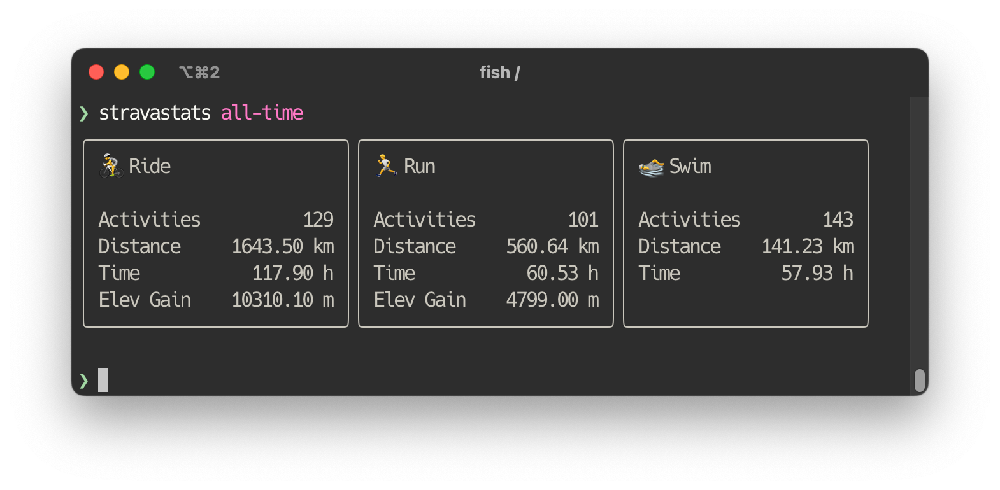

# stravastats

stravastats is a command line utility to display your personal Strava statistics in the terminal.

## Installation

There are a few ways to install stravastats for each platform. 

```bash
# Homebrew (macOS & Linux)
$ brew tap tunaitis/tools
$ brew install stravastats

# Windows
$ scoop bucket add org https://github.com/tunaitis/stravastats.git
$ scoop install tunaitis/stravastats

# Using Go directly
$ go install github.com/tunaitis/stravastats@latest
```

You can also download and manually install the binary from the [release page](https://github.com/tunaitis/stravastats/releases).

## Setup

stravastats need to authorize with Strava API before receiving any athlete data. The API uses the OAuth authorization protocol, and specifically the code authorization flow, to grant access to third parties. The code authorization flow is carried out in the following steps:

* stravastats opens a browser window to send the user to the Strava OAuth server
* The user sees the authorization prompt and approves the access request 
* The user is redirected back to the stravastats' internal web server with the authorization code in the query string
* stravastats exchanges the authorization code for an access and refresh tokens

The tokens are then placed in a secure vault and used to access the athlete's personal data later. 

### Create a Strava application

Sign into your Strava account and go to [https://www.strava.com/settings/api](https://www.strava.com/settings/api). Once there, fill the form with the appropriate values and set the authorization callback domain to localhost. Copy the application id and secret, which you will need in the next step.

### Set configuration variables

Run the following command and enter client id and secret when prompted.

```bash
$ stravastats init
```

If the configuration file already exists and you want to change a configuration variable, you can use the following command.

```bash
$ stravastats config Api.ClientId <clientId>
```

```bash
$ stravastats config Api.ClientSecret <clientSecret>
```

### Authorize

```bash
$ stravastats auth
```

The auth command will open a new browser window where you will be redirected to the Strava OAuth authorisation page. After you have given your consent, Strava will redirect you back to stravastats' internal web server, which will retrieve the passed authorisation code and exchange it for an access token, which will be securely stored in a keychain and used to access the Strava API later. 


